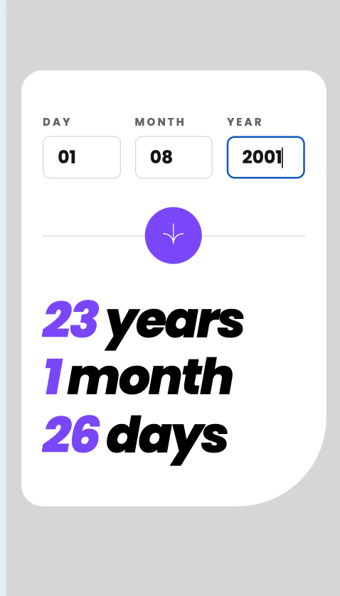
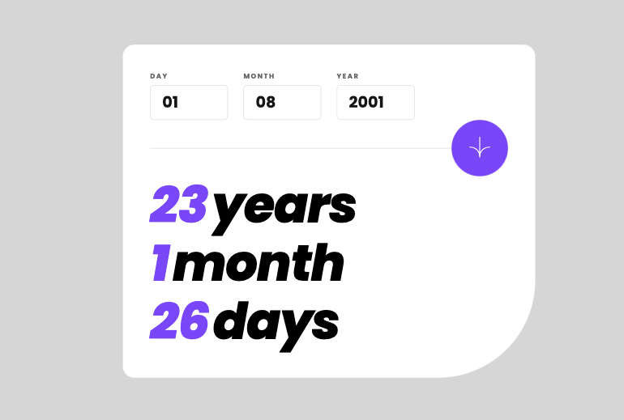
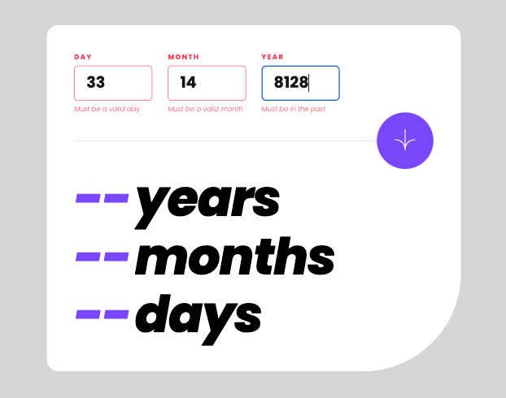
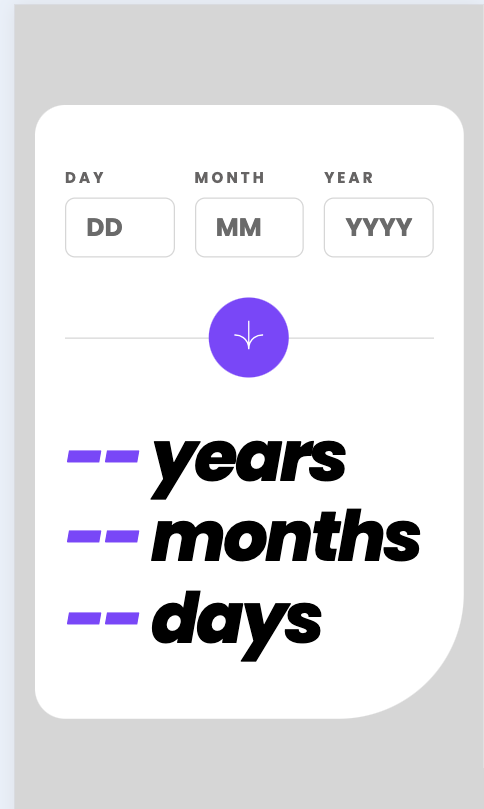
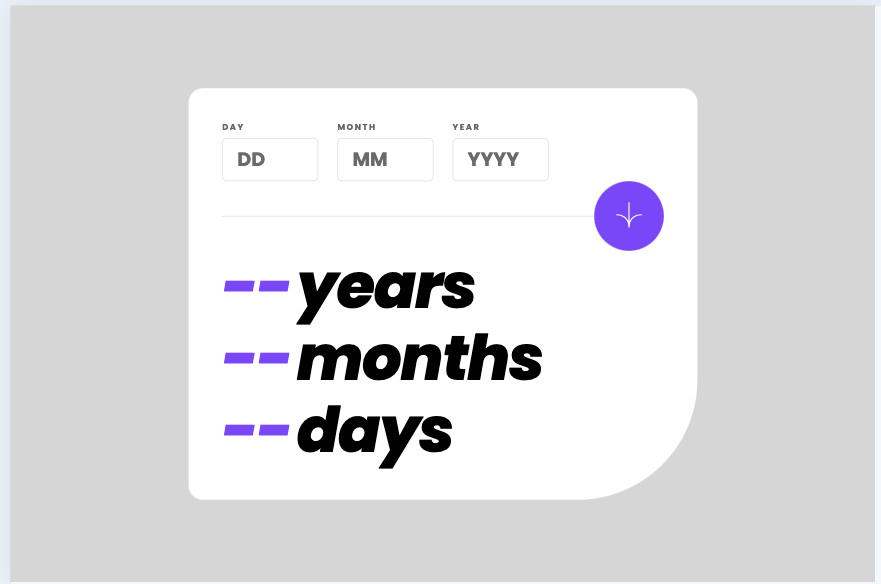

# Frontend Mentor - Age calculator app solution

This is a solution to the [Age calculator app challenge on Frontend Mentor](https://www.frontendmentor.io/challenges/age-calculator-app-dF9DFFpj-Q). Frontend Mentor challenges help you improve your coding skills by building realistic projects. 

## Table of contents

- [Overview](#overview)
  - [The challenge](#the-challenge)
  - [Screenshot](#screenshot)
  - [Links](#links)
- [My process](#my-process)
  - [Built with](#built-with)
  - [What I learned](#what-i-learned)
  - [Continued development](#continued-development)
  - [Useful resources](#useful-resources)
- [Author](#author)

## Overview

### The challenge

Users should be able to:

- View an age in years, months, and days after submitting a valid date through the form
- Receive validation errors if:
  - Any field is empty when the form is submitted
  - The day number is not between 1-31
  - The month number is not between 1-12
  - The year is in the future
  - The date is invalid e.g. 31/04/1991 (there are 30 days in April)
- View the optimal layout for the interface depending on their device's screen size
- See hover and focus states for all interactive elements on the page
- **Bonus**: See the age numbers animate to their final number when the form is submitted

I tried around a various number of algorithms, such as the Julian Day, and using JS's built-in timestamps but would get inaccurate answers. I have left that code commented out.

### Screenshot








### Links

- Solution URL: [Github](https://github.com/mroungou/age-calculator-app-2)
- Live Site URL: [Age Calculator App](https://mroungou.github.io/age-calculator-app-2/)

## My process

### Built with

- Semantic HTML5 markup
- CSS custom properties
- CSS Grid
- Mobile-first workflow

### What I learned

I had previously learned about object destructuring and I was able to use this is this project

```js
const {currentYear, currentMonth, currentDay} = currentDateDate;
const {day, month, year} = dateData // the user's birthday
```

### Continued development

In the near future, I would like to add animations once the form is being submitted.

### Useful resources

- [Handling Dates in Javascript the Wrong Way.](https://medium.com/@raphael.moutard/handling-dates-in-javascript-the-wrong-way-d98cb2835200) - I read this article as I was struggling with the accuracy of the algorithms I was using. In the end, this article directed me to libraries that I can use to simplify the calculations.
- [Age Calculator](https://www.omnicalculator.com/everyday-life/age-in-years-months-and-days) - I used this age calculator to double-check the accuracy of my calculator.
- [date-fns library](https://date-fns.org) - I used this library to help with the calculattions of the app.

## Author
- Twitter - [@mroungou](https://x.com/mroungou)
